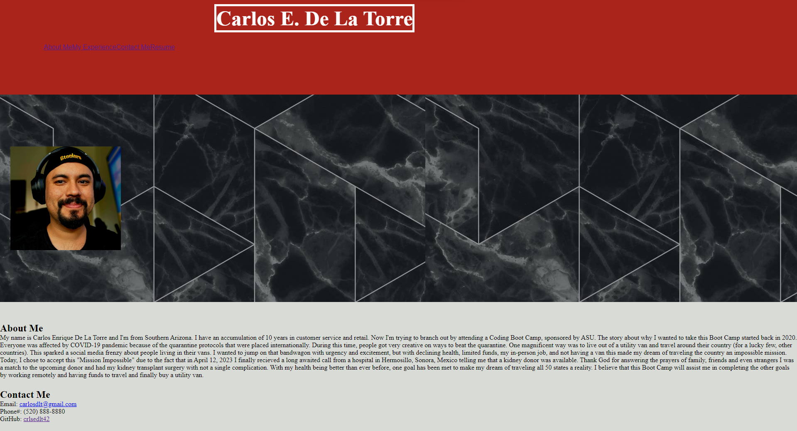

# Challenge 02 - Portfolio

## Description

For this week's challenge I was tasked to create an HTML & CSS files that would build a portfolio for any future employer to view. Topics learned over the first two weeks of class were needed to complete this challenge.

In this challenge, no initial HTML or CSS files were available to refactor. This made the challenge interesting due to the fact that everything needed to created entirely from scratch. 

This week was difficult for me because I believed I was comfortable with CSS and styling but as I started inputing code to the CSS file, I had a hard time to get the website like I had envisioned.

I will have to review all CSS classes and class activities so that I can become comfortable and proficient enough to improve on this challenge. 

## Table of Contents

- [Installation](#installation)
- [Usage](#usage)
- [License](#license)
- [Contribution](#contribution)
- [Future Development](#future-development)

## Installation

Node packages weren't used in this project, so no installation is required. 

## Usage

## License

This is free and unencumbered software released into the public domain.

Anyone is free to copy, modify, publish, use, compile, sell, or
distribute this software, either in source code form or as a compiled
binary, for any purpose, commercial or non-commercial, and by any
means.

In jurisdictions that recognize copyright laws, the author or authors
of this software dedicate any and all copyright interest in the
software to the public domain. We make this dedication for the benefit
of the public at large and to the detriment of our heirs and
successors. We intend this dedication to be an overt act of
relinquishment in perpetuity of all present and future rights to this
software under copyright law.

THE SOFTWARE IS PROVIDED "AS IS", WITHOUT WARRANTY OF ANY KIND,
EXPRESS OR IMPLIED, INCLUDING BUT NOT LIMITED TO THE WARRANTIES OF
MERCHANTABILITY, FITNESS FOR A PARTICULAR PURPOSE AND NONINFRINGEMENT.
IN NO EVENT SHALL THE AUTHORS BE LIABLE FOR ANY CLAIM, DAMAGES OR
OTHER LIABILITY, WHETHER IN AN ACTION OF CONTRACT, TORT OR OTHERWISE,
ARISING FROM, OUT OF OR IN CONNECTION WITH THE SOFTWARE OR THE USE OR
OTHER DEALINGS IN THE SOFTWARE.

For more information, please refer to <https://unlicense.org>

## Contribution

Best way to contribute will be to comment on the code to suggest how this application can be improved and collaborate to create a seemless app to improve upon.

## Future Development
